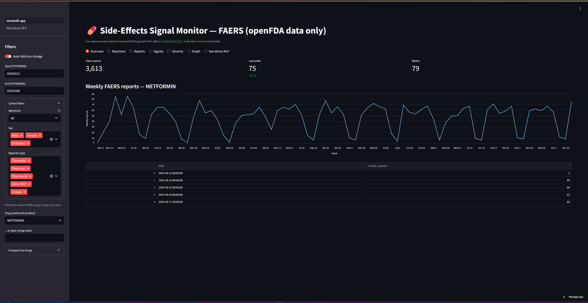
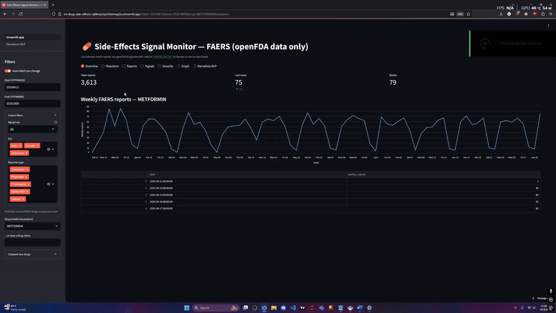

# Side Effects Signal Detection Dashboard
  
## 🎯 Project Purpose  
Detect and visualize potential adverse drug event (ADE) signals using FDA’s FAERS data. The dashboard helps pharmacovigilance analysts and researchers spot unusual trends, bursts, or disproportionality in side effect reports to prioritize investigations.

---
## 🧭 Visual Demo

*(Below is a GIF demonstration of the dashboard in action)*  


## 📊 Summary of Insights

- **Signal Strength (PRR / ROR):** Certain drug–reaction pairs (e.g. Drug X → “nausea”) show a proportional reporting ratio ~2.8× baseline — suggests elevated reporting relative to expectation  
- **Burst Events / Temporal Spikes:** A sharp increase in “dizziness” reports emerges mid-2024 for Drug Y, sustained over 4 weeks — possible emerging safety signal  
- **Reporting Volume Trend:** Overall ADE report volume dips ~15% after 2022 — could reflect reporting fatigue or regulatory changes  
- **Segment Variability:** Age group 65+ shows consistently higher rates of serious reactions; gender split shows reaction Z is 1.5× more common in females than males  
- **Comparative Baselines:** Drugs in the same class (e.g. SSRIs) show less volatile behavior; Drug X is more erratic — warrants deeper look  

---

## 🔍 Recommendations & Next Steps

- **Validate top signals clinically:** Collaborate with domain experts to assess if the statistical signals align with pharmacological plausibility.  
- **Incorporate severity / outcome modeling:** Add a model to predict likelihood of hospitalization or fatality given a signal.  
- **Alerts & threshold tuning:** Deploy an alerting system (email or dashboard notification) for signals exceeding dynamic thresholds (e.g. PRR > 3 & sustained over 2+ weeks).  
- **Subgroup deep dives:** For signals flagged, analyze by patient demographics (age, sex, comorbidities) and route of administration.  
- **Expand dataset / timeline:** Integrate international ADE datasets or more historical years to improve baseline stability.  
- **Model drift monitoring:** Monitor whether signal definitions drift over time; periodically recalibrate detection thresholds.  

---

## 🛠️ Technical Stack & Architecture

- **Data Source:** openFDA / FAERS adverse event reports  
- **Processing & Metrics:** pandas, NumPy, scikit-learn  
- **Signal Models:** disproportionality (PRR, ROR), burst detection algorithm  
- **App / Dashboard:** Streamlit + Plotly / Altair  
- **Automation / Jobs:** weekly_alerts.py (schedules alerts), data ingestion scripts  
- **API Layer (optional):** Flask endpoint (e.g. `/signals?drug=`)  
- **Model Tracking / Versioning:** MLflow or similar  


## 🚀 Quickstart

### 1. Clone and Install
```bash
git clone https://github.com/Kevinm360/ML-Drug-Side-Effects.git
cd ML-Drug-Side-Effects
python -m venv .venv && source .venv/bin/activate
pip install -r requirements.txt
