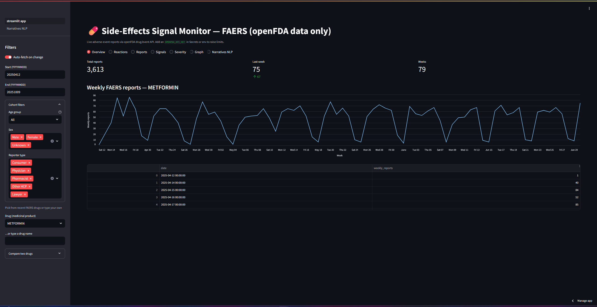
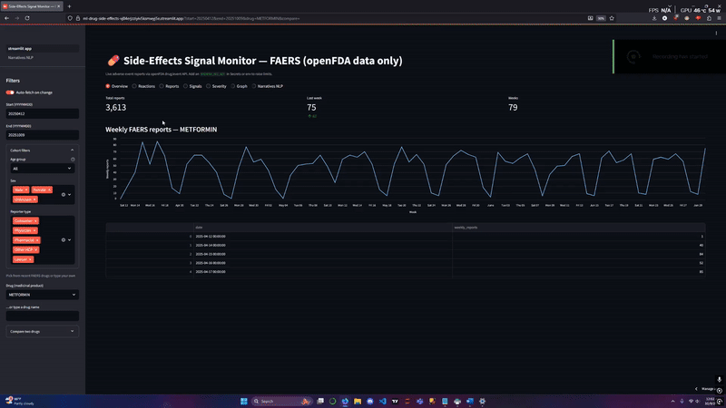

# Side Effects Signal Detection Dashboard



## Overview

This project uses FDA adverse event reports to explore patterns in reported drug side effects.

The dashboard is built around a simple question:

**Are there unusual patterns in how certain side effects are being reported, and can we identify reports that are more likely to be classified as serious?**

It combines traditional drug-safety signal detection with machine learning so users can explore both overall reporting trends and individual report characteristics.

The data comes from the FDA Adverse Event Reporting System (FAERS) through openFDA.

---

## Dashboard Demo



---

## What the Dashboard Does

Users can select a drug and explore reported adverse events over time.

The dashboard can be used to examine:

- The most commonly reported reactions for a drug
- Changes in reporting volume over time
- Sudden increases in particular side effects
- Differences between age groups, sex, and other patient characteristics
- Whether a drug-reaction combination is reported more often than expected
- How reporting patterns compare between drugs
- Whether a submitted FAERS report is likely to be labeled as serious

The goal is not to determine whether a drug caused an event. Instead, the dashboard helps identify patterns that may deserve a closer look.

---

## Drug Safety Signal Detection

The first part of the project focuses on identifying unusual reporting patterns.

### Disproportionality Analysis

The dashboard calculates measures such as **PRR** and **ROR**.

These compare how frequently a reaction is reported for one drug against how frequently that same reaction appears elsewhere in the FAERS data.

For example, if a particular side effect is reported much more frequently for one drug than expected, it may appear as a stronger signal.

A strong signal does not prove that the drug caused the reaction. It is a way of identifying combinations that may be worth investigating further.

### Reporting Spikes

The dashboard also looks for sudden increases in reports over time.

This makes it easier to spot periods where a reaction begins appearing more frequently than its recent historical pattern.

---

## Serious Outcome Classification

I added a machine learning section that looks at individual FAERS reports and predicts whether the FDA classified the report as **serious**.

A serious report may involve outcomes such as hospitalization, death, disability, or another medically significant event.

Rather than using those outcome fields to make the prediction, the models use information available elsewhere in the report, such as:

- Patient age and sex when available
- Number of drugs listed in the report
- Number of reported reactions
- How the drugs were categorized in the report
- Route of administration
- Reporter information
- Other report characteristics

Fields that directly reveal the serious outcome are removed before training. This is important because otherwise the model could simply learn the answer from information that already states the outcome.

---

## The Classification Models

The dashboard compares two different machine learning approaches.

### Logistic Regression

Logistic Regression is used as the baseline model.

It is useful because its predictions are relatively easy to interpret. The dashboard shows which variables are associated with an increase or decrease in the model's predicted probability of a serious report.

### XGBoost

XGBoost is also included because it can learn more complicated relationships between the variables.

For example, seriousness may not depend on one feature alone. It could depend on combinations of age, number of medications, administration route, or other report characteristics.

The dashboard compares XGBoost against Logistic Regression to see whether the more flexible model provides better classification performance.

---

## How the Models Are Evaluated

The models are tested on reports that were not used during training.

The dashboard reports:

- Precision
- Recall
- F1 score
- ROC-AUC
- Precision-Recall AUC
- Confusion matrix
- ROC curve
- Precision-Recall curve
- Predicted probability distributions

There is also an adjustable classification threshold.

Instead of automatically treating every prediction above 50% as serious, users can change the cutoff and see how the balance between precision and recall changes.

This helps show one of the practical tradeoffs involved in classification models: lowering the threshold may identify more serious reports, but it can also create more false positives.

---

## Checking What the Model Is Learning

FAERS contains information about both the medical report and the reporting process itself.

That creates a potential problem: a model could perform well because it learns patterns about **who submitted the report or how it was recorded**, rather than characteristics that are medically meaningful.

To investigate this, the dashboard also trains a reduced version of the models with several reporting-related variables removed.

The full and reduced models are evaluated using the same training and testing records.

This makes it possible to see how much model performance changes when information such as reporter type, reporter country, report type, and drug-role information is removed.

This does not completely eliminate reporting bias, but it provides a useful check on what may be driving the model's predictions.

---

## Important Limitations

FAERS is a spontaneous reporting system.

That means the data has several limitations:

- Not every adverse event is reported
- The same event may sometimes be reported more than once
- Many reports contain missing information
- Reporting behavior can differ between patients, healthcare professionals, manufacturers, and countries
- FAERS does not contain the total number of people taking each drug

Because of this, the dashboard cannot determine the actual probability that someone will experience a side effect.

The classification models also do not predict an individual's medical risk.

They learn patterns within submitted FAERS reports and should be treated as an analytical tool rather than a clinical decision system.

---

## Technical Stack

- **Data:** openFDA / FDA Adverse Event Reporting System (FAERS)
- **Language:** Python
- **Data Processing:** pandas, NumPy
- **Machine Learning:** scikit-learn, XGBoost
- **Classification Models:** Logistic Regression, XGBoost
- **Signal Detection:** PRR, ROR, temporal burst detection
- **Visualization:** Plotly, Altair
- **Dashboard:** Streamlit

---

## Project Structure

The application separates data retrieval, analysis, machine learning, and dashboard components.

The serious outcome classification workflow includes:

1. Retrieving report-level FAERS records
2. Cleaning and preparing the data
3. Removing variables that would directly reveal the target
4. Splitting the data into training and testing groups
5. Training Logistic Regression and XGBoost models
6. Comparing their performance
7. Examining feature importance and model behavior
8. Testing how performance changes when reporting metadata is removed

When enough historical data is available, older reports are used for training and newer reports are used for testing. This more closely reflects how a model would perform on future reports.

If that type of split is not possible, the application uses a stratified 80/20 train-test split instead.

---

## Quickstart

### 1. Clone the repository

```bash
git clone https://github.com/Kevinm360/ML-Drug-Side-Effects.git
cd ML-Drug-Side-Effects
